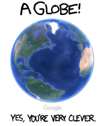
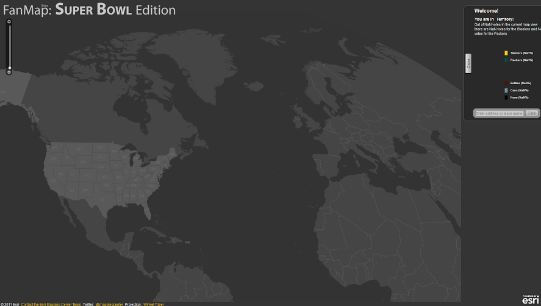

# Why the Mercator projection doesn't deserve all that hate

As anyone who has a slight interest in cartography can tell you, [Greenland is not as big as Africa](http://thetruesize.com/), even though the [Mercator projection](https://en.wikipedia.org/wiki/Mercator_projection) would lead you to thinking it is.

The amount to which the Mercator projection distorts relative size has lead cartography nerds to dismiss people who still use it as "[not really in to maps](https://www.xkcd.com/977/)", furthermore, it over-represents the size of Europe in relation to Africa, which turned in to a kind of symbol of colonialism.

But these opinions often ignore that some of the most popular services on the Internet, sites like Google Maps, use a slightly modified version of the projection, Web Mercator, to display their maps (I won't go in to the distinction between Web Mercator and Mercator, for our purposes they can be considered to be identical, hence I'll just be using the term "Mercator" from now on).

Now obviously, Google didn't just use the Mercator projection because they "don't really care about maps", after all, they run a massive product that is all about maps. There must be a reason why Google and other companies like Bing or Yandex choose to use the Mercator projection with all its flaws.

To understand that, we must first consider one of the fundamental problems of cartography: All map projections are a trade-off between different inaccuracies. The Mercator projection doesn't have all of its flaws just because the cartographers at the time didn't know any better, or because they explicitly wanted to diminish the visual importance of Africa on the map. The Mercator projection is defined the way it is, because while it contains some flaws, it also holds significant advantages over other projections.

At the time, around the sixteenth, seventeenth century, one of the main reasons why people needed maps was for navigation on the seas. The Mercator projection is great for this purpose, because [rhumbs](https://en.wikipedia.org/wiki/Rhumb_line) (lines of constant bearing) are straight lines in this projection, or in other words: Say you wanted to sail from Cape Town to New York. You take out your Mercator map, draw a straight line between the two, measure the angle, and then just sail away and make sure your compass stays at that angle. This won't necessarily give you the shortest path, but it's a very simple path as you don't have to do any trigonometry calculations.

"Sure, that's great for 17th century navigation," you say, "but how is this useful for Google Maps?"

Well, let's consider the challenges a digital mapping service faces, that do not arise for paper maps. The main difference between a digital map and a paper map is, that you can't zoom in to the latter one. Cartographers typically use different projections for world maps and maps of just one country. Many smaller countries, for example the Netherlands, use a [stereographic projection](https://en.wikipedia.org/wiki/Stereographic_projection), which is nice for a small area, but not so much when looking at the entire planet. Unfortunately, Google can't just switch the projection when the user zooms beyond a certain level or moves to a different place, which brings us to one of the main requirements for a projection for digital maps:

> Google needs a map projection that works reasonably well at all scales, all across the globe (well, most of it at least).

While defining the subjective criterion of "works well" is a bit more difficult, we have some intuition about how a map is supposed to work. For navigating locally, in an area over which the curvature of the earth is negligible, it's useful if the projection doesn't distort angles, stretch the map in one direction, or bend straight lines. Essentially: if I go forwards 60 metres, turn 90 degrees to the right, and walk another 60 metres, the trace I leave in the snow corresponds to the shape I would draw on the map. Nothing fancy here, this is kind of like saying that maps for small areas should look like aerial photos without any distortion. Furthermore, it would be nice if north was always up.

This is basically what we would get if we were to use a stereographic projection centered around the place we're looking at. Now the problem with this projection is, that it gets distorted more and more as you move outside the zone of negligible curvature. Which means that in order to preserve the properties listed above, the stereographic projection would have to be constantly recentred as you move across the map, and that would be inconvenient for several reasons. It would significantly impact performance, since the service couldn't just store fixed tiles, but would effectively have to recalculate the projection every time, and more importantly, I'd imagine this to be a very nauseating experience if you're moving around on a scale where an entire continent is in view, because while the centre would look alright, everything around it would warp as you're moving around. (Note to self: Implement this at some point just to see how bad it is. Note to everyone else: If you happen to have implemented this, or are about to, please tell me, I would love to have a look at it!)

We are thus looking for a map projection where north is up everywhere and local angles remain accurate, without having to change the projection. Well this sounds pretty much like what we've heard about the Mercator projection. A small square area should remain square in a Merator projection, since the bearing from the bottom left to the top right corner (45°) has to correspond to the angle on the map, which is how we know that the square won't turn out as a rectangle in the map. Keeping the relative scale of Greenland and Africa to realistic values would be nice, but since there are more important requirements, they now appear to be of roughly equal size if you zoom all the way out on Google Maps.

Of course, Google kept looking for a better alternative, and so they did what every reasonable person would do when they realize that you can't just take a 3d sphere and turn it in to a 2d map without any artifacts:

---

In fact, Esri once got bored with the Mercator projection when they did a [project for the 2011 Super Bowl](https://blogs.esri.com/esri/arcgis/2011/02/18/an-alternative-to-web-mercator-winkle-triple/). They used the [Winkel tripel projection](https://en.wikipedia.org/wiki/Winkel_tripel_projection), but centered on the USA, which leads to a nice projection across the USA (which was the point of the project), but you can tell that something seems off about Europe..

